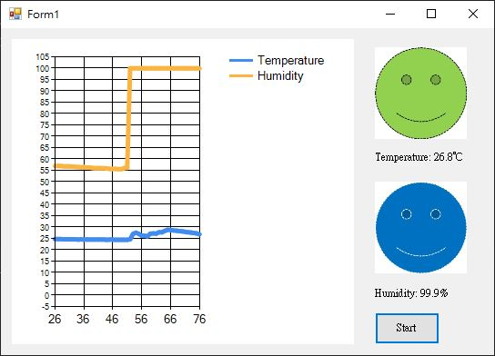
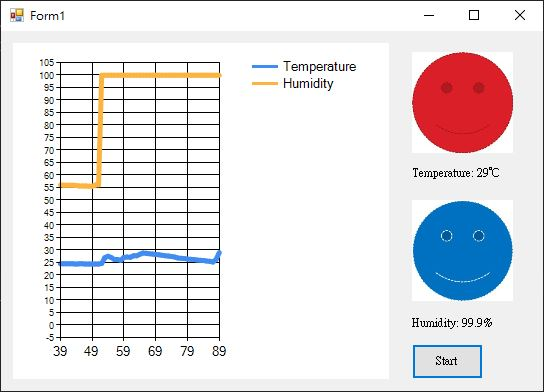

# Tuesday HMI(Human-Machine Interface) class
### A HMI in C#
---

## Contents
- What is HMI
- Objective
- Motivation
- Features
- Screenshots

### What is HMI
[HMI](https://www.aveva.com/en/solutions/operations/hmi/)
>The Human Machine Interface (HMI) is the interface between the processor machine and the operator. In essence, it’s an operator’s dashboard. This is the primary tool operators and line supervisors use to coordinate and control industrial and manufacturing processes and machines. HMIs translate complex process variables into usable and actionable information.

---

### Objective
To undertanding how to create a simple HMI in C#

---

### Motivation
I want to know how indoor temperature and humidity change with time create a GUI app with vstudio is very easy.

---

### Features
- Arduino will start after click Start button
- Read indoor temperature and humidity from Arduino and show it on screen.
- When temperature
    - higher than 28°C show red face
    - between 28°C and 22°C show green face
    - lower than 22°C show blue face
- When humidity
    - higher than 70% show blue face
    - between 70% and 40% show green face
    - lower than 40% show red face

---

### Screenshots 

---